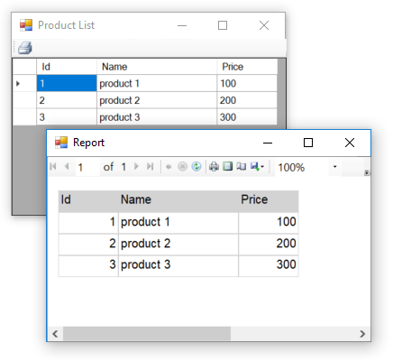

# Creating dynamic RDLC reports at run-time

This example shares an idea about how to create dynamic RDLC reports ar run-time. 

As an option to create `RDLC` report dynamically at at run-time, I have used [Run-Time Text Templates](https://msdn.microsoft.com/en-us/library/ee844259.aspx). I've created a simple grid report template taht it's columns and data can be dynamically at run-time. You also can set title, width, header back color for columns.

You can use this technique dependent from any kind of contrlol or even use it in web forms. 

To create and show dynamic report it's enough to add some columns to the ReportForm and then set data and show the form. For example

	var f = new ReportForm();
	f.ReportColumns = this.dataGridView1.Columns.Cast<DataGridViewColumn>()
                          .Select(x => new ReportColumn(x.DataPropertyName)
                          {  
                              Title = x.HeaderText, 
                              Width = x.Width 
                          }).ToList();
	f.ReportData = this.dataGridView1.DataSource;

